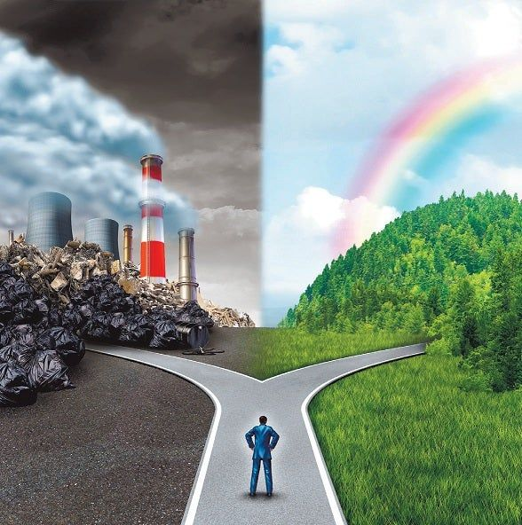

En conclusión, la contaminación ambiental es una amenaza seria para la salud humana, los ecosistemas y el clima global,los retos ambientales representan uno de los desafíos más urgentes y complejos de nuestra era. 
El cambio climático, la deforestación, El calentamiento global, la Contaminación, Pérdida de biodiversidad, Sequía, Consumo abusivo, Residuos, Desconexión social, etc. Estos problemas afectan de manera directa la calidad de vida, intensificando fenómenos climáticos extremos, alterando patrones agrícolas y afectando la seguridad hídrica y alimentaria.

Si bien a escala nacional ha habido algunos avances en el desarrollo de políticas que integran los requisitos medioambientales en la toma de decisiones como los planes de acción ecológicos o los requisitos de las evaluaciones medioambientales estratégicas, queda todavía un largo camino por recorrer para instaurar estas medidas a escala paneuropea. No obstante, hay posibilidades de alcanzar mejoras lo suficientemente significativas para atajar los impactos medioambientales del aumento de la producción y el consumo.

Para enfrentar estos retos, es crucial implementar medidas que incluyan políticas ambientales más estrictas, fomentar la transición hacia energías renovables, promover la economía circular y adoptar tecnologías sostenibles. Así como la educación ambiental y la concienciación global son esenciales para promover una revolucion en el comportamiento en todos los niveles de la sociedad. Las acciones concretas, tanto a nivel individual como colectivo, son necesarias para mitigar los impactos negativos y garantizar la sostenibilidad del planeta para las futuras generaciones.

