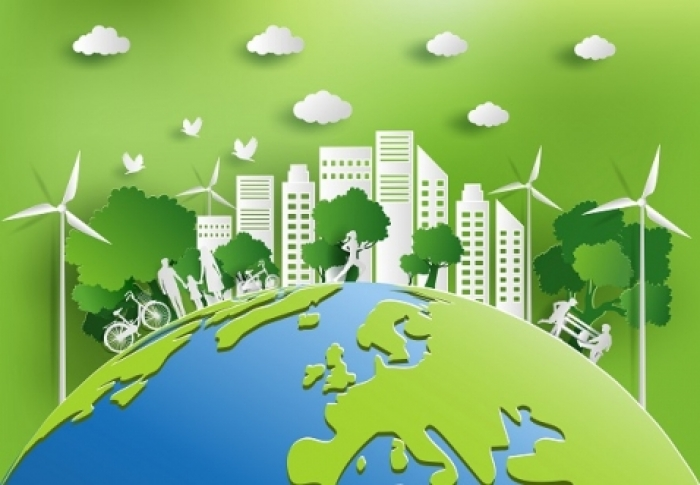

## **Introducción**

Los problemas ambientales y sociales actuales están estrechamente relacionados con el modelo de desarrollo y la explotación de los recursos naturales. Las prácticas actuales de extracción de estos recursos están generando tensiones y daños cada vez mayores, y el cambio climático está acelerando estos efectos. A medida que los recursos se agotan y el clima cambia, los impactos negativos se agravan, afectando tanto al medio ambiente como a las comunidades humanas.

Uno de los principales desafíos ambientales es la gestión del agua, ya que muchas regiones enfrentan una creciente escasez de este recurso esencial, lo que tiene consecuencias tanto para las personas como para los ecosistemas. Otro desafío importante es la biodiversidad, ya que la destrucción de hábitats naturales y la sobreexplotación de especies están acelerando la pérdida de biodiversidad, lo que amenaza el equilibrio ecológico global. La gestión de los bosques y el uso del suelo también presenta problemas, ya que la deforestación y el uso inadecuado del suelo están causando la erosión del medio ambiente y la pérdida de recursos. Además, las zonas costeras y marinas enfrentan grandes retos debido a la contaminación, el aumento del nivel del mar y la sobreexplotación de recursos marinos, lo que pone en peligro los ecosistemas marinos y las comunidades costeras.

A nivel social, uno de los mayores retos es el conocimiento incompleto sobre el cambio climático, ya que muchas personas y gobiernos aún no comprenden completamente cómo afecta el cambio climático a la vida en el planeta, lo que dificulta la implementación de políticas adecuadas para mitigar sus efectos. Además, existe una falta de valoración del costo real de los recursos naturales, ya que a menudo no se consideran los efectos a largo plazo de su explotación, lo que lleva a decisiones que priorizan el beneficio inmediato sobre la sostenibilidad. También existen grandes desigualdades económicas y sociales entre aquellos que se benefician de la explotación de los recursos naturales y aquellos que sufren sus consecuencias, lo que genera una creciente brecha de pobreza y desigualdad. Por último, la ausencia de políticas y sistemas de gobernanza efectivos en muchos países impide una respuesta adecuada a estos problemas, ya que no se han desarrollado políticas ambientales adaptadas a las necesidades locales y globales.

En conjunto, estos desafíos requieren un enfoque integral que promueva la sostenibilidad y la equidad. Es necesario trabajar en soluciones que no solo protejan el medio ambiente, sino que también garanticen un futuro más justo y seguro para todos.
