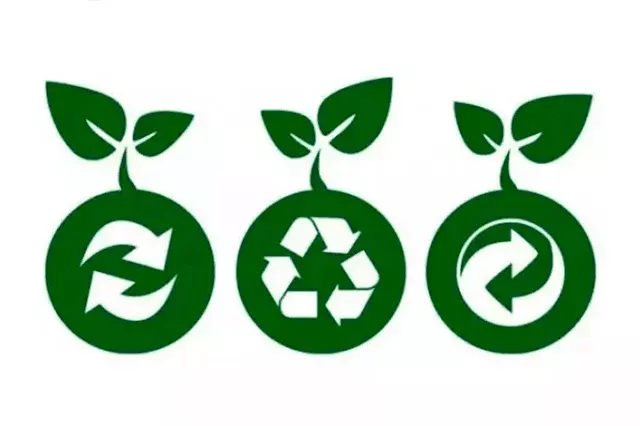

# Medidas y acciones para minimizar los impactos ambientales.

**Eficiencia energética**: Realiza auditorías energéticas y evalúa periódicamente el consumo de energía y el aislamiento térmico de equipos de frío y calor. AINIA ofrece herramientas y casos prácticos para ayudar a las pymes a implementar tecnologías energéticas eficientes y renovables, como la recuperación de calor residual y la energía solar térmica.

**Gestión responsable del agua**: Controla y reduce el consumo de agua, y reutiliza corrientes en tu instalación. AINIA ha colaborado en proyectos como VIOe, que implementa sistemas para valorizar residuos de aguas residuales y producir biometano.

**Valoración de residuos**: Busca oportunidades para valorizar residuos transformándolos en biogás, biomasa, fertilizantes o productos de valor. AINIA ha trabajado en proyectos como Simbynet para fomentar la simbiosis industrial y optimizar el aprovechamiento de subproductos entre empresas.

**Optimización de envases**: Desarrolla un plan para reducir el uso de envases y utilizar materiales biodegradables o reciclables. Se investigan soluciones como bioplásticos y ecodiseño de envases.

**Cálculo de la huella ambiental**: Realiza un Análisis del Ciclo de Vida (ACV) para identificar el impacto ambiental de tus productos y procesos, y establecer objetivos de mejora.

**Gestión de residuos peligrosos**: Mejora la gestión de residuos urbanos y peligrosos. AINIA participa en proyectos como URBIOFIN para transformar residuos orgánicos urbanos en bioproductos.

**Sensibilización y formación**: Capacita a tus empleados en prácticas ambientales sostenibles. AINIA promueve la formación y el compromiso con los ODS de la ONU.

**Reducción de vertidos contaminantes**: Aplica técnicas de depuración eficientes y reutilización del agua para reducir la contaminación de los vertidos industriales.

**Mejora del diseño de productos**: Considera la sostenibilidad en el diseño de nuevos productos, fomentando el ecodiseño y la economía circular, donde los residuos se convierten en recursos reutilizables.

**Compromiso con el medio ambiente**: Integra la gestión ambiental en la estrategia empresarial, implementando sistemas de gestión medioambiental y responsabilidad social, alineados con los ODS de la Agenda 2030.

